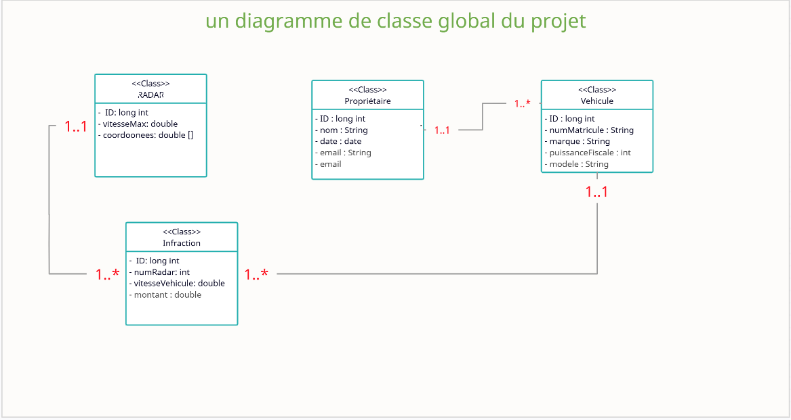

# 🍃 SprinBootApplication & Distributed Systems: RadarVehiculeSimulation 🚀🚀

### On souhaite créer un système distribué basé sur les micro-services sous SpringBoot. Cette application devrait permettre de gérer et d’automatiser le processus des infractions concernant des véhicules suites à des dépassement de vitesses détectés par des radars automatiques.
---
**Voici les 3 micro-services de mon applciation:**

1. **Radar-service** qui permet de gérer les radars. Chaque radar est défini par son id, sa vitesse maximale, des coordonnées : Longitude et Latitude.

2. **Immatriculation-service** qui permet de gérer des véhicules appartenant des propriétaires.

3. **infractions-service** qui permet de gérer les infractions.

# 📝 Table of Contents
- [Architecture](#architecture)
- [Class Diagram](#class-diagram)
- [Registration service](#registration-service)
- [Infraction service](#infraction-service)
- [Radar service](#radar-service)
- [Radar gRPC client](#radar-grpc-client)
- [Eureka discovery and gateway](#eureka-discovery-and-gateway)
- [Angular client](#angular-client)
- [Security with Keycloak](#security-with-keycloak)
- [Docker](#docker)

# Architecture

# Class Diagram

## Etapes d'execution de projet: 
  1.  Executer le service **EurekaDiscoveryService - microservice** : 
  ⚡️il représente l'annuaire des micro-service déployés. Il enregistre dynamiquement les micro-service à l'aide de service **Gateway**

==================

  2. Executer le service **Gateway - microservice** :
  ⚡️ c'est la passerelle conçu pour enregistrer les 3 micro-service ( Radar , Infraction et immatriculation) sur l'annuaire **EurekaDiscoveryService**

==================

  3. Executer le service **immatriculation-service** :
   - a) Création des enregistrements de type **Voiture** et les stocker dans la base de données relative à l'entité Voiture.
   - b) Création des enregistrements de type **Proprietaire** dont chacun , aura un enregistrement **Voiture** et les stocker dans la base de données relative à l'entité **Proprietaire**.
   - c) Accéder à la page web des enregistrements voiture: 
        -  http://localhost:8085/IMMATRICULATION-SERVICE/vehicules
        - [@voiture-microservice](http://localhost:8085/IMMATRICULATION-SERVICE/vehicules)
        - le port 8085 correspond à le service **Gateway** 

   - d) Accéder à la page web des enregistrements roprietaire: 
        -  http://localhost:8085/IMMATRICULATION-SERVICE/proprietaires
        - [@proprietaire-microservice](http://localhost:8085/IMMATRICULATION-SERVICE/proprietaires)

==================

  4. Executer le service **Infraction-service** :
   - a) Création des enregistrements de type **Infraction** et les stocker dans la base de données relative à l'entité Infraction.

        

# Angular client
- Table with all radars registered in the system

- Radar registration form

- Radar consultation

- Table with all infractions registered in the system

- Infraction registration form

- Infraction consultation

- Table with all vehicles registered in the system

- Vehicle registration form

        
## Authors

- [@Oussama El Aloui](https://www.github.com/Oussez)

